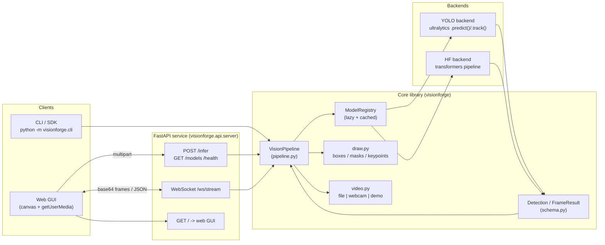

# vision-forge 🔥

> Real-time, multi-task computer vision in one coherent platform — detection, segmentation, pose, tracking & classification, exposed through a Python library, a FastAPI service, a thin SDK/CLI, and a clean browser GUI.

[](LICENSE)
[](https://www.python.org/)
[](.github/workflows/ci.yml)
[](https://github.com/astral-sh/ruff)
[](https://github.com/ultralytics/ultralytics)

`vision-forge` wires the [Ultralytics YOLO](https://github.com/ultralytics/ultralytics) family
(plus an optional [HuggingFace Transformers](https://huggingface.co/) DETR / ViT backend) behind
a single normalized result schema, a drawing layer, a streaming pipeline, and a websocket-powered
web UI. Run it on a laptop CPU with the built-in synthetic `--demo`, point it at an image/video,
or stream your webcam straight to the browser.

---

## ✨ Features

- **5 vision tasks** — object detection, instance segmentation, pose/keypoints, multi-object
  tracking (ByteTrack), and image classification, behind one API.
- **Pluggable backends** — primary [Ultralytics YOLOv8](https://github.com/ultralytics/ultralytics)
  engine; alternate HuggingFace `transformers` pipeline (`facebook/detr-resnet-50` detector,
  `google/vit-base-patch16-224` classifier).
- **Normalized schema** — every backend returns the same `Detection` / `FrameResult` shape
  (xyxy boxes, masks, keypoints, track ids), unit-tested and JSON-serializable.
- **FastAPI service** — `/health`, `/models`, `/infer` (multipart upload), and a live
  `/ws/stream` WebSocket.
- **Browser GUI** — drag-and-drop an image or stream your webcam over the websocket; dark, modern,
  zero-build vanilla JS, renders boxes/masks/keypoints + live FPS on a canvas.
- **No-hardware demo** — `--source demo` generates synthetic frames so you can try the whole
  pipeline on a CPU with no camera and no committed weights.
- **Lazy & cached** — model weights auto-download from Ultralytics/HF on first use and are cached;
  nothing heavy is imported until you actually run inference.
- **Light footprint** — no weights, datasets, or `node_modules` in the repo; a `requirements-min.txt`
  path runs the tests with zero torch.

---

## 🏗️ Architecture



Text fallback:

```
Clients (CLI / Web GUI)
        |
        v
FastAPI service  --  /infer (HTTP)  |  /ws/stream (WebSocket)  |  / (GUI)
        |
        v
VisionPipeline -> ModelRegistry (lazy, cached)
        |                 |
        v                 v
   draw.py / video.py   YOLO backend  ||  HF backend
        |                 |                 |
        +------>  Normalized FrameResult / Detection schema
```

---

## 🚀 Quickstart

```bash
# 1. clone & enter
git clone https://github.com/OCT0PUSPR/vision-forge && cd vision-forge

# 2a. lightweight path (no torch) — runs tests, lint, the synthetic frame demo
python -m venv .venv && source .venv/bin/activate
pip install -r requirements-min.txt
pytest -q

# 2b. full path (real inference) — pulls torch + ultralytics + transformers
pip install -r requirements.txt        # or: pip install -e ".[ml,dev]"

# 3. run the no-hardware synthetic demo (weights auto-download on first infer)
python -m visionforge.cli detect --source demo --task detection

# 4. launch the API + web GUI, then open http://localhost:8000
python -m visionforge.cli serve --port 8000
```

### Docker

```bash
docker compose up --build           # serves on http://localhost:8000
# or
docker build -t vision-forge . && docker run -p 8000:8000 vision-forge
```

---

## 🧑‍💻 Usage examples

**CLI**

```bash
# synthetic demo, 30 frames
python -m visionforge.cli detect --source demo --task detection

# a single image, save annotated output
python -m visionforge.cli detect --source photo.jpg --task segmentation --save out.jpg

# pose estimation on a video file
python -m visionforge.cli detect --source clip.mp4 --task pose

# webcam multi-object tracking (ids persist across frames)
python -m visionforge.cli detect --source 0 --task tracking

# alternate HuggingFace DETR detector
python -m visionforge.cli detect --source photo.jpg --task detection --backend hf

# write a synthetic demo image (no model needed)
python -m visionforge.cli demo-image --out demo.jpg
```

**Python library / SDK**

```python
from visionforge import VisionPipeline

pipe = VisionPipeline(task="detection")          # backend="hf" for DETR
result = pipe.run_image("photo.jpg")
print(result.count_by_label())                   # {'person': 2, 'dog': 1}
for det in result.detections:
    print(det.label, round(det.confidence, 2), det.bbox)

# stream a video / webcam / demo
for idx, res, annotated in pipe.run_stream("demo", max_frames=10, annotate=True):
    print(idx, res.to_dict()["counts_by_label"])
```

**HTTP API (curl)**

```bash
curl -s http://localhost:8000/health
curl -s http://localhost:8000/models | python -m json.tool
curl -s -F "file=@photo.jpg" -F "task=detection" -F "annotate=true" \
     http://localhost:8000/infer | python -m json.tool
```

---

## 📚 API reference

| Method | Path          | Body / params                                                                 | Returns |
| ------ | ------------- | ----------------------------------------------------------------------------- | ------- |
| GET    | `/`           | —                                                                             | Web GUI (HTML) |
| GET    | `/health`     | —                                                                             | `{status, version, device}` |
| GET    | `/models`     | —                                                                             | Available tasks, backends, default thresholds |
| POST   | `/infer`      | multipart: `file` (image), `task`, `backend?`, `annotate?` (bool)             | `{result: FrameResult, annotated?: dataURL}` |
| WS     | `/ws/stream`  | JSON frames (see protocol below)                                              | JSON `result` messages |

### WebSocket protocol (`/ws/stream`)

Client → server (text JSON):

```json
{
  "type": "frame",
  "task": "detection",
  "backend": "yolo",
  "image": "data:image/jpeg;base64,<...>",
  "frame_index": 12,
  "annotate": false
}
```

Server → client (text JSON):

```json
{
  "type": "result",
  "frame_index": 12,
  "result": { "task": "detection", "count": 3, "detections": [ ... ] },
  "annotated": "data:image/jpeg;base64,<...>"  // only if annotate=true
}
```

Also supported: `{"type":"ping"}` → `{"type":"pong"}`; any error returns
`{"type":"error","message":"..."}`. The browser GUI sends raw frames and draws the boxes
client-side from `result.detections`, so it stays responsive even without `annotate`.

### `FrameResult` JSON shape

```json
{
  "task": "detection",
  "width": 640, "height": 480,
  "frame_index": 0, "inference_ms": 12.4,
  "model": "yolov8n.pt",
  "count": 2,
  "counts_by_label": {"person": 2},
  "detections": [
    {"label": "person", "confidence": 0.91, "bbox": [x1,y1,x2,y2],
     "class_id": 0, "track_id": 3, "mask": [[x,y],...], "keypoints": [...]}
  ],
  "classification": null
}
```

---

## ⚙️ Configuration

All settings load from environment variables (prefix `VF_`), optionally via a `.env` file. See
[`.env.example`](.env.example). Secrets (`HF_TOKEN`) are read from the environment only — never
hardcoded.

| Variable                  | Default                        | Description |
| ------------------------- | ------------------------------ | ----------- |
| `VF_DEVICE`               | `auto`                         | `auto` picks cuda → mps → cpu |
| `VF_CONF_THRESHOLD`       | `0.25`                         | Detection confidence threshold |
| `VF_IOU_THRESHOLD`        | `0.45`                         | NMS IoU threshold |
| `VF_IMAGE_SIZE`           | `640`                          | Inference image size |
| `VF_DETECTION_MODEL`      | `yolov8n.pt`                   | YOLO detection weights id |
| `VF_SEGMENTATION_MODEL`   | `yolov8n-seg.pt`               | YOLO segmentation weights id |
| `VF_POSE_MODEL`           | `yolov8n-pose.pt`              | YOLO pose weights id |
| `VF_TRACKING_MODEL`       | `yolov8n.pt`                   | YOLO model used with ByteTrack |
| `VF_CLASSIFICATION_MODEL` | `google/vit-base-patch16-224`  | HF classifier id |
| `VF_HF_DETECTION_MODEL`   | `facebook/detr-resnet-50`      | HF alternate detector id |
| `VF_TRACKER`              | `bytetrack.yaml`               | Ultralytics tracker config |
| `VF_HOST` / `VF_PORT`     | `0.0.0.0` / `8000`             | Server bind address |
| `VF_MAX_UPLOAD_MB`        | `25`                           | Max `/infer` upload size |
| `HF_TOKEN`                | _(unset)_                      | HuggingFace token for gated models |

---

## 🗂️ Project structure

```
vision-forge/
├── visionforge/
│   ├── __init__.py            # public API, lazy VisionPipeline export
│   ├── config.py              # pydantic-settings, device auto-detect
│   ├── pipeline.py            # VisionPipeline orchestration
│   ├── cli.py                 # detect / serve / demo-image commands
│   ├── core/
│   │   ├── schema.py          # Detection / FrameResult / Keypoint (dep-free)
│   │   ├── draw.py            # boxes/masks/keypoints + pure color helpers
│   │   └── video.py           # file | webcam | synthetic demo iterator, FPS
│   ├── models/
│   │   ├── registry.py        # lazy, cached task->backend registry
│   │   ├── yolo_backend.py    # ultralytics wrapper -> normalized schema
│   │   └── hf_backend.py      # transformers detector + classifier
│   └── api/
│       ├── server.py          # FastAPI app (HTTP + WebSocket + static)
│       ├── encoding.py        # base64 / data-URL / image (de)serialization
│       └── web/               # index.html + app.js + style.css (zero-build)
├── tests/                     # pytest (schema/draw/encoding) — no torch needed
├── examples/                  # run_demo.py, infer_image.py
├── requirements.txt           # full runtime (incl. torch/ultralytics/transformers)
├── requirements-min.txt       # lightweight test/CI path (no torch)
├── pyproject.toml             # packaging, ruff, pytest config
├── Dockerfile / docker-compose.yml
├── .env.example
└── .github/workflows/ci.yml   # compileall + ruff + pytest + docker build
```

---

## 📈 Benchmarks

Indicative throughput on CPU (`yolov8n.pt`, 640px). Numbers vary by hardware and are not measured
in CI — run `python -m visionforge.cli detect --source demo` to benchmark locally via the printed
per-frame milliseconds and the GUI's live FPS meter.

| Task          | Model            | Device     | Typical |
| ------------- | ---------------- | ---------- | ------- |
| Detection     | yolov8n          | laptop CPU | ~6–15 FPS |
| Segmentation  | yolov8n-seg      | laptop CPU | ~4–10 FPS |
| Pose          | yolov8n-pose     | laptop CPU | ~5–12 FPS |
| Tracking      | yolov8n+ByteTrack| laptop CPU | ~5–12 FPS |
| Any (YOLOv8n) | —                | CUDA GPU   | 60+ FPS |

---

## 🗺️ Roadmap

- [ ] Batched / async inference workers for higher websocket throughput
- [ ] ONNX / TensorRT export path for edge deployment (`*.onnx`, `*.engine`)
- [ ] Server-side annotated video recording + MP4 export
- [ ] Region-of-interest & line-crossing counting on top of tracking
- [ ] Open-vocabulary detection backend (YOLO-World / Grounding DINO)
- [ ] Prometheus metrics endpoint + structured logging
- [ ] Auth (API keys) and per-client rate limiting on the API
- [ ] Model warmup on startup + readiness gating

---

## 🤝 Contributing

Issues and PRs welcome. Run `ruff check .` and `pytest -q` before submitting. Heavy ML deps are
optional for the test suite (everything heavy is import-guarded).

## 📄 License

Released under the **MIT License** © 2026 **OCT0PUSPR**. See [LICENSE](LICENSE).
